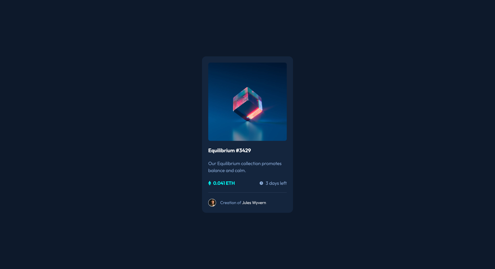

# Frontend Mentor - NFT preview card component

This is a solution to the [NFT preview card component challenge on Frontend Mentor](https://www.frontendmentor.io/challenges/nft-preview-card-component-SbdUL_w0U). 

Users should be able to:

- View the optimal layout depending on their device's screen size
- See hover states for interactive elements

## Screenshot

## Links
- [Source](https://github.com/mothy-08/fm-nft-preview-card-component)
- [Live](https://mothy-08.github.io/fm-nft-preview-card-component/)

## Built with
- HTML 
- CSS

## What I learned
Tried a new CSS approach by incorporating BEM and CUBE methodologies 
